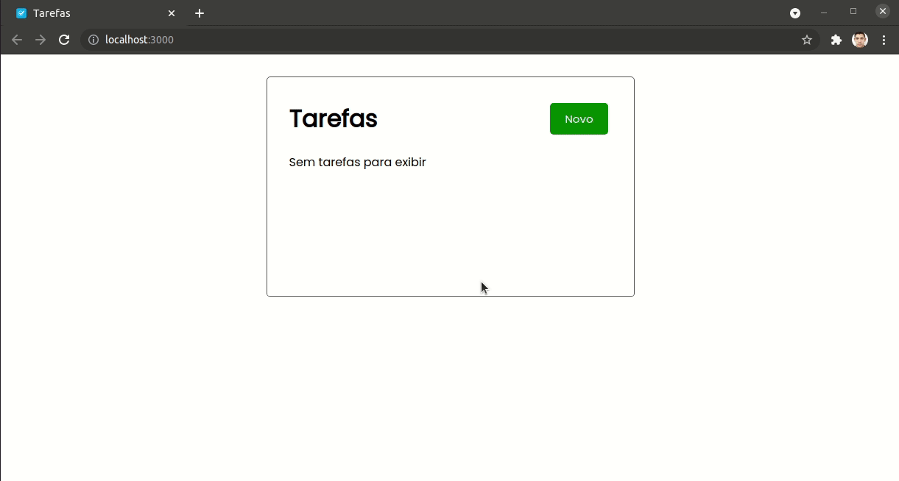
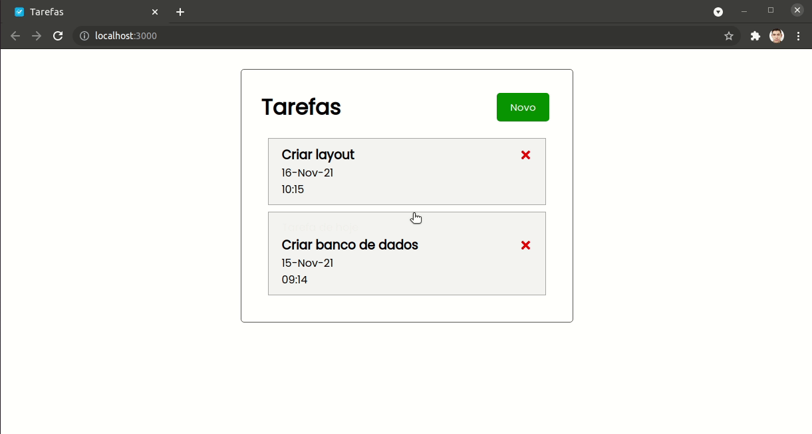

<h1 style="text-align: center; font-weight: bold;">Newsletter</h1>

## Demo 📸

<div align="center" >
  
   
</div>

---

## Sobre o Projeto

O Projeto Task foi desenvolvido para um Teste Prático nas tecnologias: JavaScript, ReactJS e MongoDB.

Para ver o **BackEnd**, clique aqui: [Backend Tarefas](https://github.com/leandrosuy/task-backend)

### 🛠 Tecnologias

As seguintes ferramentas foram usadas na construção do projeto:

- [NodeJS](https://nodejs.dev/)
- [Axios](https://github.com/axios/axios)
- [ReactJS](https://pt-br.reactjs.org/)
- [MomentJS](https://momentjs.com/)


---

Antes de começar, você vai precisar ter instalado em sua máquina as seguintes ferramentas:
[Git](https://git-scm.com), [Node.js](https://nodejs.org/en/).
Além disto é bom ter um editor para trabalhar com o código como [VSCode](https://code.visualstudio.com/)

### 🎲 Rodando o App Web

```bash
# Clone este repositório
$ git clone https://github.com/leandrosuy/task-frontend

# Instale as dependências
$ npm install

# Execute a aplicação apatir da pasta Task
$ npm start

```

<a href="https://raw.githubusercontent.com/ARTHURPC03/Proffy-FullStack/master/github/linkedin.png">
</a>
<br />

Veja meu Linkedin: [Leandro Dantas](https://www.linkedin.com/in/leandro-dantas-1959b711b/)